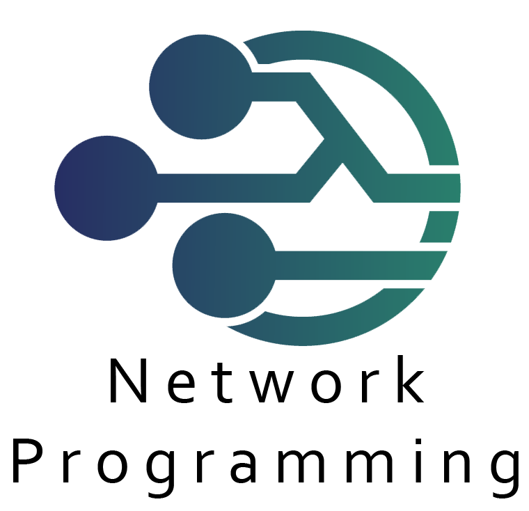

 

  

  <h3 align="center">Resolve วิชา Network Programming</h3>

  

เฉลยวิชา Network Programing 030513362

<!-- รายการ Labs -->
  
<h2 style="display: inline-block">Table of Contents</h2>

  <ol>
    <li><a href="network/lab1">Lab 1 : Introduction to Java </a></li>
    <li><a href="network/lab2">Lab 2 : Java I/O </a></li>
    <li><a href="network/lab3">Lab 3 : Java Thread </a></li>
    <li><a href="network/lab4/philosophers">Lab 4 : Java Thread 2 </a></li>
  </ol>
